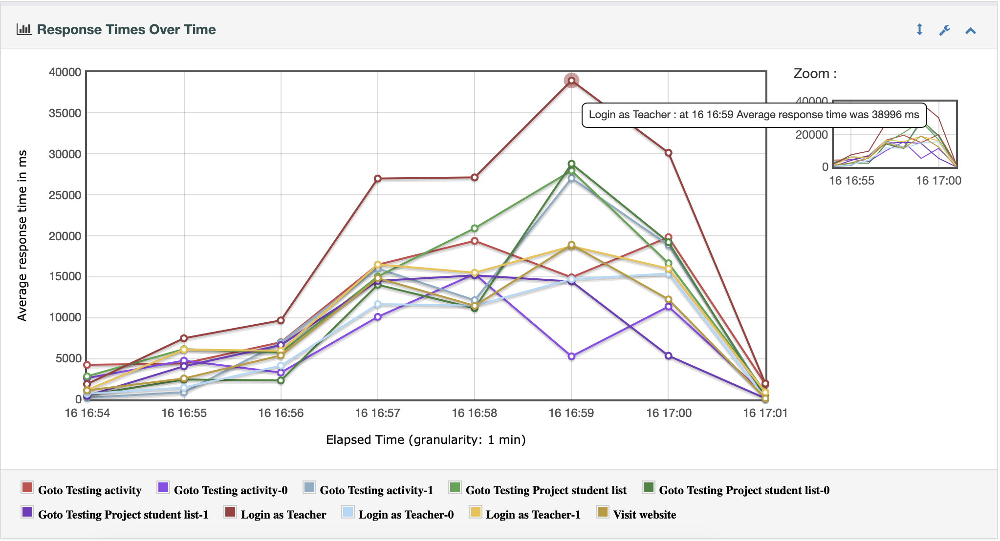
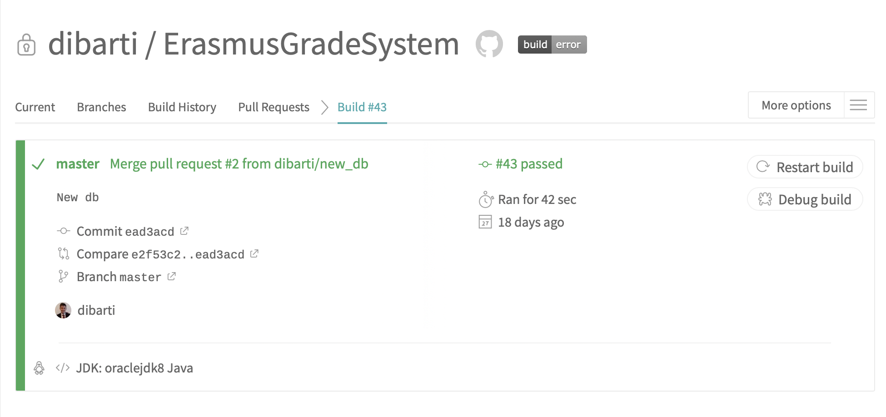
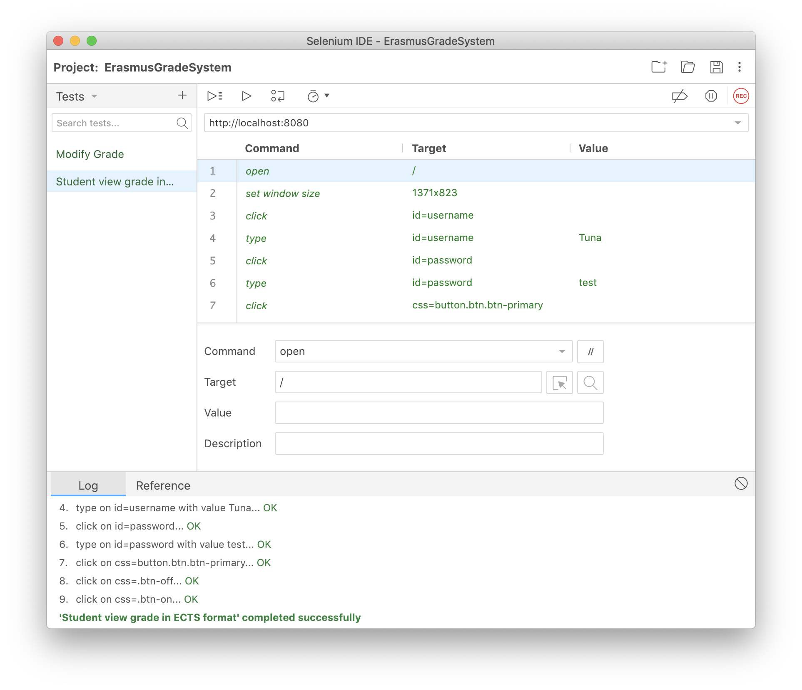

# ErasmusGradeSystem

In this web application are students able to see their grades. The students have an option to view their grades in the ECTS format.

## Techniques used

* Java
* Spring MVC
* Hibernate
* JUnit
* Travis
* JMeter

## Database

The database has to be imported to be able to use the web app.
Use [DBexportV3.sql](DBexport/exportV3.sql) to import the database

## Stress test dashboard

Open index.html in the [dashboard](dashboard) folder to view the results of the Stress test

## Documents

* [Risk Table](Documents/RiskTable.pdf)
* [Guerilla Test Presentation](Documents/GuerillaTest.pdf)
* [Specifications](Documents/Specification%26TestCases/Specifications.pdf)
* [Test Cases](Documents/Specification%26TestCases/Test%20cases.xlsx)

## Travis CI

## Selenium Tests

## Checklist

* Req. spec. -> Test Cases -> Acceptance Test
  * simulate acceptance test and document
  * upload documents and summary from review of requirements and test cases
* Short risk analysis to help prioritize what to test (risk-based test)
* Unit test - Possibly automated build (CI) and/or TDD?
* Integration Test (chosen approach)
* Possibly Selenium test scripts
* Stress Performance Tests (Load/Stress/Peak/Soak) - remember to take screenshots of graphs and measure memory consumption just after start and just before end of the Soak Test
* Usability Test (upload answers to questions as well as log of tests and conclusions

### Note

The commits from before 19/11/2018 are lost due to switching to Spring MVC/Hibernate. A new project has been made and the HEAD from the master branch has been overwritten.
